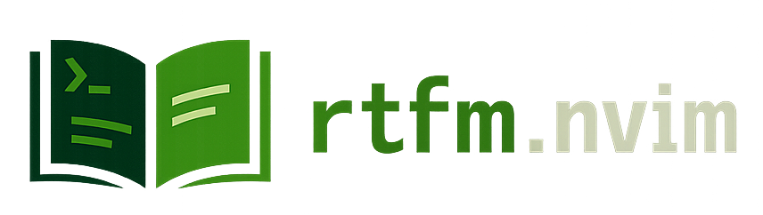

<br/>
<br/>

<div align="center">
  
</div>

<br/>

<div align="center">


&nbsp;&nbsp;

&nbsp;&nbsp;

&nbsp;&nbsp;

&nbsp;&nbsp;


</div>

<br/>
<br/>
<br/>
<br/>

Generate and store local markdown docs for languages/frameworks via pluggable adapters.

## Requirements

- `curl`
- `pandoc` (required for HTML -> Markdown conversion)

## Setup

```lua
require("rtfm").setup({
	ensure_installed = { "python" },
})
```

If `ensure_installed` is omitted, nothing is downloaded until `:RtfmInstall` is run.

## User Commands

- `:RtfmInstall <adapter>`
- `:RtfmUninstall <adapter>`

The command argument is completed from registered adapters.

## Registering Adapters

Built-in adapters are defined in `lua/rtfm.lua`:

```lua
	M.adapters = {
	python = "rtfm.adapters.python",
}
```

You can register your own adapter module at runtime:

```lua
require("rtfm").register_adapter("my_lang", "my-plugin.adapters.my_lang")
```

## Creating a New Adapter

Create a file like `lua/rtfm/adapters/my_lang.lua` and return `Adapter.define(...)`.

```lua
local Adapter = require("rtfm.abc-adapter.adapter")
local Rule = require("rtfm.abc-adapter.rule")

return Adapter.define({
	doc = "my_lang",
	builtins = {
		url = "https://example.com/docs/index.html",
		seed_sources = {
			"https://example.com/docs/intro.html",
			"https://example.com/docs/functions.html",
		},
		documentation_rules = {
			Rule.deep_tag("section"),
			Rule.heading_level(2),
		},
		name_rule = Rule.regex([[<section id="\zs[^"]\+\ze"]]),
	},
})
```

### Adapter Spec Fields

- `doc`: output directory name (for example `python`)
- `builtins` / `stdlib` / `misc`: optional crawler specs

Crawler spec:

- `url` (required): root docs URL
- `seed_sources` (optional): additional full `https://...` source URLs to include
- `source_rules` (optional): rule chain for extracting source URLs from `url` (if empty, discovery is skipped)
- `documentation_rules` (required): rule chain for extracting doc sections
- `name_rule` (required): rule that extracts the section name from each documentation fragment

Useful rule helpers:

- `Rule.tag("section")`: top-level matching tags
- `Rule.deep_tag("section")`: nested matching tags as well
- `Rule.heading_level(2)`: keep only fragments whose first heading is `h2`

Docs are always written as:

`<scope>/<source_name>/<normalized_name>.md`

Normalization is fixed in core:

- if the extracted name starts with `<source_name>.`, that prefix is removed
- `._...` becomes `__`
- remaining `.` become `__`

Examples:

- `os.system` -> `os/system.md`
- `os.PathLike.__fspath__` -> `os/PathLike__fspath__.md`
- `os.stat_result.st_mode` -> `os/stat_result__st_mode.md`

Generated markdown is wrapped for terminal readability, and each scope root gets a numbered `_index.md` file that preserves extraction order.

## Output Layout

Docs are written under `stdpath("data") .. "/rtfm/"`, typically:

```text
<data>/rtfm/
  python/
	  builtin/
		introduction/introduction.md
		compound_stmts/if.md
		_index.md
	  stdlib/
		os/system.md
		_index.md
	  misc/
```
