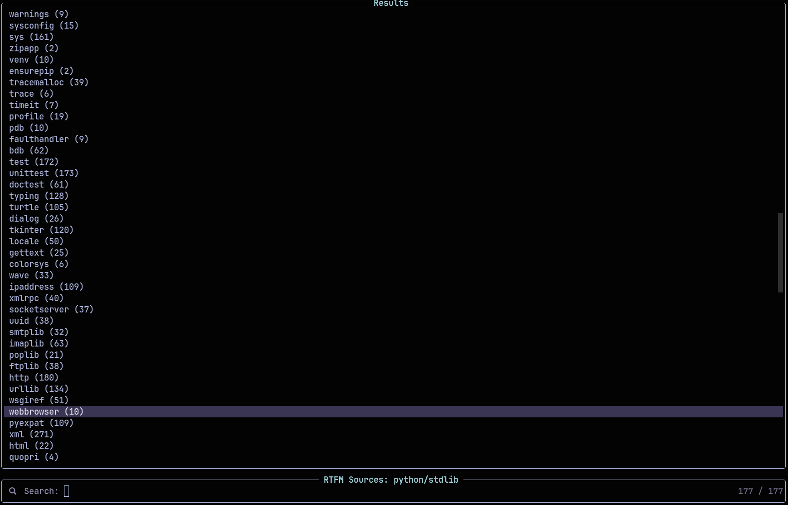
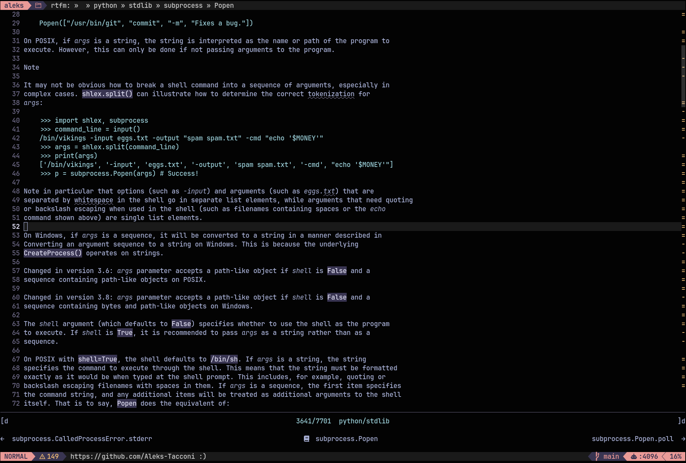

<br/>
<br/>

<div align="center">
  
</div>

<br/>

<div align="center">

<strong>Read The Friendly Manual ● Download and search through official documentation ● Standardized documentation format for every framework</strong>

</div>

<div align="center">


&nbsp;

&nbsp;

&nbsp;

&nbsp;


</div>

<br/>
<br/>

## About

This plugin was inspired by [devdocs.nvim](https://github.com/maskudo/devdocs.nvim), but I wanted something that fit my workflow better. I found that some language builtins were missing, along with a few frameworks I wanted to explore, so I built `rtfm.nvim`. It is designed to make adding adapters for new languages and frameworks simple and plug-and-play.

In the age of AI it is easy to ask ChatGPT for documentation, but that often skips a lot of the detail and context you get from reading the official docs. The goal of this plugin is to make the official docs quick enough to access that they feel more convenient than asking AI first.

<div align="center">
  
</div>

<br/>

<div align="center">
  
</div>

## Requirements

- `curl`
- `pandoc` (required for HTML -> Markdown conversion)
- `Nerd Font` (optional, for viewer icons)
- `telescope.nvim` (required for `:RtfmBrowse`)

## Setup

```lua
{
	"Aleks-Tacconi/rtfm.nvim",
	dependencies = {
		"nvim-telescope/telescope.nvim",
	},
	config = function()
		require("rtfm").setup({
			ensure_installed = { "python", "go" },
			keymaps = {
				manage = "<leader>rm",
				browse = "<leader>rb",
			},
			viewer = {
				keymaps = {
					prev = "[d",
					next = "]d",
				},
			},
		})
	end,
}
```

> If `ensure_installed` is omitted, nothing is downloaded until you install an adapter from `:RtfmManage`

`setup().keymaps` configures the global mappings for `:RtfmManage` and `:RtfmBrowse`. Set either side to `false` or `""` to disable it.

`setup().viewer.keymaps` configures the buffer-local mappings for `:RtfmDocPrev` and `:RtfmDocNext` inside the viewer.

## User Commands

- `:RtfmManage`
- `:RtfmBrowse`
- `:RtfmDocNext`
- `:RtfmDocPrev`

If the adapter you want is not built-in, you can create your own. See the [adapter guide](https://github.com/Aleks-Tacconi/rtfm.nvim/blob/main/ADAPTERS.md).

## Output Layout

Docs are written under `stdpath("data") .. "/rtfm/"`, typically:

```text
<data>/rtfm/
  go/
	  builtin/
		builtin/pkg-overview.md
		builtin/pkg-functions.md
		_index.md
	  stdlib/
		net/http/pkg-overview.md
		fmt/pkg-functions.md
		_index.md
  python/
	  builtin/
		introduction/introduction.md
		compound_stmts/if.md
		_index.md
	  stdlib/
		os/system.md
		_index.md
	  misc/
```
